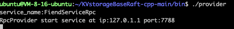
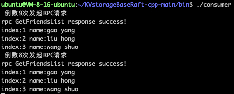
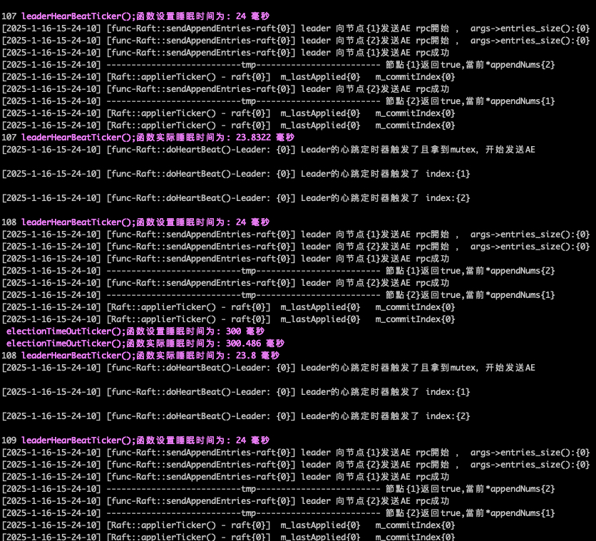

# Overview

## Repo Set up

### 1.Library
- muduo
- boost
- protoc
- clang-format（Optional）

**Installation**

- clang-format, if you do not design submit pr, then do not install, here also give the installation command: `sudo apt-get install clang-format`
- protoc: The local version is 3.12.4. The ubuntu22 installation runs sudo apt-get install `protobuf-compiler libprotobuf-dev`
- boost，`sudo apt-get install libboost-dev libboost-test-dev libboost-all-dev`
- muduo,https://blog.csdn.net/QIANGWEIYUAN/article/details/89023980

### 2.Compiling

#### First Start rpc
```
cd KVstorageBaseRaft-cpp
mkdir cmake-build-debug
cd cmake-build-debug
cmake ..
make
```
Then the corresponding executable file is generated in the bin directory:

* provider
* consumer

```
./provider
``` 




In another window, execute consumer

```
./consumer
``` 



Run it, pay attention to run the provider first, then run the consumer, the reason is simple: you need to provide the rpc service before you can call.

#### Using a raft cluster
Then the corresponding executable file is generated in the bin directory.

```
// make sure you in bin directory ,and this has a test.conf file
./raftCoreRun -n 3 -f test.conf
```



It is recommended to use clion/clion nova and click this button:


After normal operation, the command line should have the following raft running output:
```

20231228 13:04:40.570744Z 615779 INFO  TcpServer::newConnection [RpcProvider] - new connection [RpcProvider-127.0.1.1:16753#2] from 127.0.0.1:37234 - TcpServer.cc:80
[2023-12-28-21-4-41] [Init&ReInit] Sever 0, term 0, lastSnapshotIncludeIndex {0} , lastSnapshotIncludeTerm {0}
[2023-12-28-21-4-41] [Init&ReInit] Sever 1, term 0, lastSnapshotIncludeIndex {0} , lastSnapshotIncludeTerm {0}
[2023-12-28-21-4-41] [Init&ReInit] Sever 2, term 0, lastSnapshotIncludeIndex {0} , lastSnapshotIncludeTerm {0}
[2023-12-28-21-4-41] [       ticker-func-rf(1)              ]  选举定时器到期且不是leader，开始选举

[2023-12-28-21-4-41] [func-sendRequestVote rf{1}] 向server{1} 發送 RequestVote 開始
[2023-12-28-21-4-41] [func-sendRequestVote rf{1}] 向server{1} 發送 RequestVote 開始
[2023-12-28-21-4-41] [func-sendRequestVote rf{1}] 向server{1} 發送 RequestVote 完畢，耗時:{0} ms
[2023-12-28-21-4-41] [func-sendRequestVote rf{1}] elect success  ,current term:{1} ,lastLogIndex:{0}

[2023-12-28-21-4-41] [func-sendRequestVote rf{1}] 向server{1} 發送 RequestVote 完畢，耗時:{0} ms
[2023-12-28-21-4-41] [func-Raft::doHeartBeat()-Leader: {1}] Leader的心跳定时器触发了

[2023-12-28-21-4-41] [func-Raft::doHeartBeat()-Leader: {1}] Leader的心跳定时器触发了 index:{0}

[2023-12-28-21-4-41] [func-Raft::doHeartBeat()-Leader: {1}] Leader的心跳定时器触发了 index:{2}

[2023-12-28-21-4-41] [func-Raft::sendAppendEntries-raft{1}] leader 向节点{0}发送AE rpc開始 ， args->entries_size():{0}
[2023-12-28-21-4-41] [func-Raft::sendAppendEntries-raft{1}] leader 向节点{2}发送AE rpc開始 ， args->entries_size():{0}
[2023-12-28-21-4-41] [func-Raft::doHeartBeat()-Leader: {1}] Leader的心跳定时器触发了
```

#### Using kv
Start 'callerMain' after starting the raft cluster.
